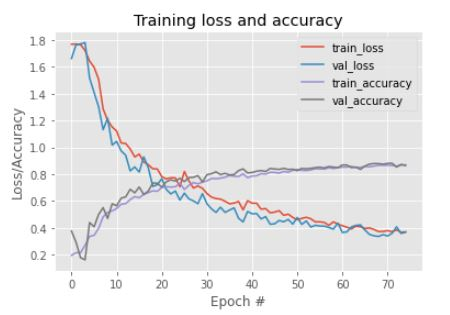
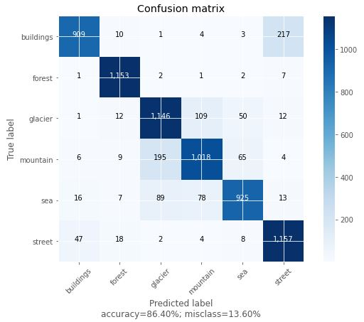

# CV_Assignment_3 Classification of Natural Scene Images
This repository contains source code for computer vision assignment 3 on natural scene images classification into 6 categories i.e.
1) Buildlings
2) Forest
3) Glacier
4) Mountain
5) Sea
6) Street

## Dataset
We have used kaggle natural image scene dataset available on the link
https://www.kaggle.com/puneet6060/intel-image-classification/version/2

## CNN Model Details
We have used VGG-16 architecture for classification of images along with Keras Image Data Augmentation techniques like horizontal & vertical flip, width & height shift, zoom, shear etc. Model has been trained on 75 epochs with learning rate of 0.01 with SGD(Stochastic Gradient Descent) optimizer

## Training Results
We trained model on over 14k images with over 3k validation images. Training accuracy & loss graph is as follows

## Test Results
We tested model on over 7k. Confusion matrix is as follows

## How to run
Repository contains CV_Assignment_3.ipynb python notebook. Just simply run it on Google Colab or Jupyter. with following python 3.6.9 dependecies.
tensorflow => 2.3
numpy => 1.19.4   
Keras => 2.4.3          
Keras-Preprocessing => 1.1.2  
sklearn => 0.24

Just make sure to change dataset path according to your machine for uninterrupted running of notebook

### Model weights file
'model' directory contains the trained model weights
it is also avilable at: 
https://drive.google.com/file/d/1-3nBcB9PkLq-AkMchClHAZDxtTAhkSwj/view?usp=sharing
